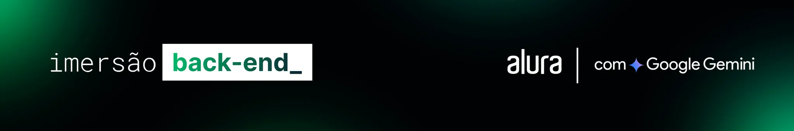

# Imersão Back-End da Alura

    

## Descrição

Este repositório contém o código fonte do projeto desenvolvido durante a Imersão Back End da <a href="https://www.alura.com.br">Alura</a> com apoio do Google Gemini. O objetivo principal é criar um blog de fotos completo, desde a estrutura básica do back-end até a integração com APIs externas.

## Principais Tecnologias Utilizadas

<h3>Node.js</h3>
    
Ambiente de execução JavaScript para o lado do servidor.
 

<h3>Express.js</h3>
 
Framework web minimalista e flexível para Node.js.
 
<h3>MongoDB</h3>
 
Banco de dados NoSQL utilizado para armazenar as informações do blog.
 

